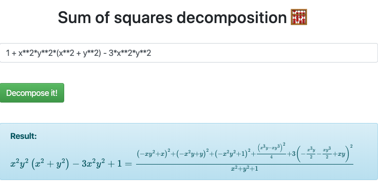

# decompoly
Code and maths described in greater detail in paper [Description of decompoly](description_of_decompoly.pdf).

`decompoly` takes as input a polynomial in one or several variables with rational coefficients, and attempts to output an exact decomposition of the polynomial as a sum of squares of rational functions (SOSRF) with rational coefficients, modulo symbolic simplifications. 

## OpenAI
`decompoly` is a semidefinite-programming solution to the last problem on OpenAI's list of unsolved problems [Requests for Research 2.0](https://openai.com/blog/requests-for-research-2/): _Automated Solutions of Olympiad Inequality Problems_.

The mathematical explanation is that olympiad inequalities are special cases of the problem of trying to prove a given polynomial is non-negative, which follows from [Artin's proof of Hilbert's 17th problem](https://link.springer.com/article/10.1007%2FBF02952513) that every real non-negative polynomial has an expression as a SOSRF with real coefficients. To solve OpenAI's problem, one just needs an effective / algorithmic version of Artin's proof, which `decompoly` provides for a large set of polynomials.

Indeed, the vast majority of olympiad inequality problem ask that we prove that a given inequality involving rational functions in multiple variables `x, y, z,…` holds for all real and non-negative `x, y, z,…`. Such a problem reduces to a problem of proving a polynomial in `X, Y, Z,…` is non-negative for all real values of variables `X, Y, Z,…` via the following steps:
- replace each variable by its square, e.g. `x` by `X:= x**2`, so that `X ≥ 0` is automatic if `x` is real; 
- collect all terms on left-hand-side and clear denominators so the left-hand-side is a polynomial `p(X, Y, Z,…)` we need to compare to `0`;
- multiply by `-1` if necessary to make the inequality of the form `p(X, Y, Z,…) ≥ 0`.

## Example
Inputting the Motzkin polynomial `1 + x**2*y**2*(x**2 + y**2) - 3*x**2*y**2` in the 
[Heroku app](https://decompoly.herokuapp.com/) running off decompoly gives the following simplified decomposition, which also proves that the Motzkin polynomial is non-negative for all real values of `x` and `y`. Multiplying the numerator and denominator on the right-hand side with `x**2 + y**2 + 1` and distributing is the unsimplified decomposition as a SOSRF.

For a list of other non-negative polynomials `decompoly` can decompose, look at the suite of [unit tests](tests/test.py).

## App
Code is running on a simple [Heroku app](https://secure-shelf-02448.herokuapp.com/).

## Requirements to run app
- Python 3.7
- sympy
- numpy
- scipy
- cvxopt
- numba
- Flask
- wtforms
- gunicorn

